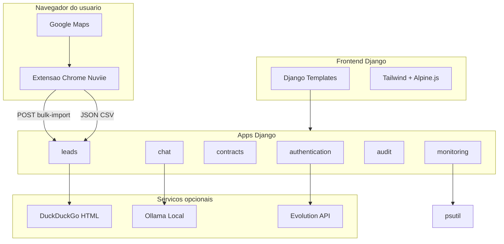

# 🚀 Nuviie Hub

> **Plataforma completa para prospecção local** — extraia leads do Google Maps no Chrome, gerencie vendas no Kanban, gere contratos em PDF e simule atendimento comercial com IA.


---

## ✨ O que é o Nuviie?

O **Nuviie Hub** é um monólito Django modular para uso **local** (você e sua equipe):

- 🗺️ **Extrair leads do Google Maps** via extensão Chrome (recomendado) — sem CAPTCHA, no navegador logado
- 📊 **Organizar oportunidades** num CRM Kanban visual
- 📄 **Gerar contratos** a partir de templates PDF
- 💬 **Simular atendimento** com IA local (Ollama)
- 🔐 **Autenticar com segurança** — e-mail, WhatsApp OTP e login facial

Interface moderna com tema escuro, Tailwind CSS e Alpine.js.

---

## 🧩 Módulos do Sistema

| Módulo | O que faz | Onde |
|--------|-----------|------|
| 📈 **Dashboard** | Métricas, gráficos e leads recentes | `/dashboard/` |
| 🗺️ **Extensão Maps** | Extração completa no Chrome (**recomendado**) | pasta `extension/` |
| 📥 **Importar Leads** | Upload JSON/CSV exportado pela extensão | `/leads/import/` |
| 📸 **Scraper Instagram** | Busca perfis por nicho e cidade | `/scraper/instagram/` |
| 📋 **CRM Kanban** | Pipeline de vendas com drag-and-drop e exclusão em massa | `/kanban/` |
| 📑 **Contratos** | Templates PDF + preview ao vivo + export PDF/DOCX | `/contracts/templates/` |
| 📊 **Analytics Servidor** | CPU, RAM, disco, rede (psutil) | `/monitoring/analytics/` |
| 📜 **Histórico** | Auditoria de ações no sistema | `/audit/history/` |
| 💬 **Chat IA** | Assistente comercial com Ollama | `/chat/` |
| 👤 **Autenticação** | Login, registro, face, OTP WhatsApp | `/auth/login/` |

---

## ⚡ Início Rápido

### 1️⃣ Pré-requisitos

- Python **3.12+**
- **Google Chrome** (para a extensão Maps)
- **Ollama** (opcional, só para o chat IA)

### 2️⃣ Instalar o Nuviie

```bash
cd Nuviie
python -m venv .venv
.venv\Scripts\activate        # Windows
# source .venv/bin/activate   # Linux/Mac
pip install -r requirements.txt
copy .env.example .env        # Windows
# cp .env.example .env        # Linux/Mac
```

### 3️⃣ Configurar o `.env`

Mínimo para rodar localmente:

```env
SECRET_KEY=sua-chave-secreta-aqui
DEBUG=true
ALLOWED_HOSTS=127.0.0.1,localhost

# Extensão Chrome (recomendado para Maps)
NUVIIE_EXTENSION_TOKEN=seu-token-secreto-aqui
NUVIIE_EXTENSION_USER=admin
```

> `NUVIIE_EXTENSION_USER` deve ser o **username** de um usuário Django existente (ex.: o criado com `createsuperuser`).

### 4️⃣ Banco e usuário

```bash
python manage.py migrate
python manage.py createsuperuser
```

### 5️⃣ Rodar o servidor

```bash
python manage.py runserver
```

Acesse: **http://127.0.0.1:8000/**

### 6️⃣ Instalar a extensão Chrome

1. Abra `chrome://extensions/`
2. Ative **Modo do desenvolvedor**
3. Clique em **Carregar sem compactação**
4. Selecione a pasta `Nuviie/extension/`

Pronto — o ícone **Nuviie Maps Extractor** aparece na barra do Chrome.

---

## 📖 Guia Completo por Funcionalidade

### 🗺️ Extensão Chrome — Nuviie Maps Extractor (recomendado)

**O que faz:** extrai leads completos do Google Maps **no seu Chrome logado**, sem Playwright e com muito menos bloqueio. Para cada lugar da lista, a extensão:

1. Clica na ficha no painel lateral
2. Faz scroll para carregar conteúdo lazy
3. Expande horários de funcionamento
4. Visita a aba **Sobre** (amenidades)
5. Visita a aba **Avaliações** (até 10 reviews recentes)
6. Revela telefone/endereço ocultos
7. Extrai todos os campos e segue para o próximo (com delay humano)

**Dados coletados por lead:**

| Campo | Exemplo |
|-------|---------|
| Nome, categoria, cidade | Escritório Silva, Advogado |
| Telefone / WhatsApp | (16) 99999-8888 |
| Site, Instagram, Facebook, YouTube, LinkedIn | @escritorio, URLs |
| Endereço, rating, nº de avaliações | Av. Paulista, 4.8, 127 |
| Horários (JSON) | seg–sex, aberto/fechado |
| Reviews recentes (JSON) | autor, nota, texto |
| Amenidades, Plus Code, faixa de preço | Wi-Fi, estacionamento |
| Link Google Maps | maps.google.com/... |

**Fluxo de uso:**

1. Abra [Google Maps](https://www.google.com/maps)
2. Busque (ex: `advogado Ribeirão Preto`)
3. **Role a lista** até carregar todos os resultados desejados
4. Clique no ícone **Nuviie Maps Extractor**
5. Preencha **Cidade** (obrigatório) e **Nicho** (opcional)
6. Clique em **Extrair completo**
7. Aguarde — ~2–4 s por lugar (50 lugares ≈ 2–3 min)
8. Escolha uma opção:
   - **Export JSON** ou **Export CSV** — salva arquivo local
   - **Enviar ao Nuviie** — envia direto pro CRM (configure token abaixo)

**Enviar direto ao Nuviie:**

1. No popup da extensão, abra **Nuviie local (opcional)**
2. URL: `http://127.0.0.1:8000`
3. Token: mesmo valor de `NUVIIE_EXTENSION_TOKEN` no `.env`
4. Com o servidor rodando, clique **Enviar ao Nuviie**

**Estrutura da extensão:**

```
extension/
├── manifest.json       → Manifest V3
├── popup.html/js/css   → Interface do popup
├── content.js          → Orquestrador no Maps
├── extract-all.js      → Extração principal (port do scraper)
├── extract-hours.js    → Horários de funcionamento
├── extract-reviews.js  → Avaliações recentes
├── extract-about.js    → Amenidades (aba Sobre)
├── navigate.js         → Cliques em abas, scroll, delays
├── mapper.js           → Converte dados → formato Lead
└── utils.js            → Helpers (dedup, telefone, etc.)
```

**Dicas:**

- Uma busca no Maps costuma mostrar até ~120 resultados — role bastante ou faça buscas por bairro/nicho
- Use **Parar** no popup se quiser interromper no meio
- **Limite 0** = extrai todos os lugares visíveis na lista
- Grátis para uso local — não precisa publicar na Chrome Web Store

---

### 📥 Importar Leads (arquivo)

**O que faz:** importa JSON ou CSV exportado pela extensão para o CRM.

**Como usar:**

1. Acesse `/leads/import/` (ou **Importar Leads** no dashboard)
2. Selecione o arquivo `.json` ou `.csv` exportado
3. Clique em **Importar leads**
4. Leads duplicados (mesmo telefone, nome ou Instagram) são ignorados automaticamente

---

### 📸 Scraper Instagram

**O que faz:** busca perfis do Instagram via DuckDuckGo usando nicho e localização.

**Como usar:** `/scraper/instagram/` — informe nicho, localização e filtros.

> Resultados dependem do DuckDuckGo — pode retornar zero em alguns nichos.

---

### 📋 CRM Kanban

**Status:** Novo Lead → Contatado → Em Negociação → Retornou → Fechado / Perdido

**Como usar:**

1. Acesse `/kanban/`
2. Arraste cards entre colunas
3. Clique em um card para editar, ver notas ou abrir WhatsApp/Maps
4. Exporte em CSV/JSON, crie leads manualmente ou exclua em massa (selecionados / todos)

Cada lead tem **score de qualidade (0–100)** calculado automaticamente.

---

### 📑 Contratos PDF

Upload de templates com placeholders `{{ campo }}` ou `[CAMPO]`, preenchimento e download do PDF gerado.

Acesse: `/contracts/templates/`

---

### 💬 Chat IA (Ollama)

```bash
ollama pull qwen2.5:7b
ollama serve
```

Configure no `.env` (opcional):

```env
OLLAMA_URL=http://localhost:11434/api/chat
OLLAMA_MODEL=qwen2.5:7b
```

Acesse `/chat/` — o Ollama **não é obrigatório** para leads e Kanban.

---

### 🔐 Autenticação

- Login/cadastro: `/auth/login/` e `/auth/register/`
- Login facial: `/auth/face-register/` + `/auth/face-login/`
- Reset de senha via WhatsApp: `/auth/password-reset/` (Evolution API ou simulado no console)

---

## 🔌 API REST

Base: `http://127.0.0.1:8000/api/leads/`

### Importação em lote (extensão Chrome)

```bash
curl -X POST http://127.0.0.1:8000/api/leads/bulk-import/ \
  -H "Content-Type: application/json" \
  -H "X-Nuviie-Token: seu-token-secreto-aqui" \
  -d '{
    "city": "Ribeirão Preto",
    "leads": [
      {
        "name": "Escritório Exemplo",
        "category": "Advogado",
        "phone_number": "(16) 99999-8888",
        "source": "google_maps"
      }
    ]
  }'
```

Resposta: `{"saved": 1, "skipped": 0, "errors": []}`

### Listar / filtrar leads (requer login)

```bash
curl -u email@exemplo.com:senha http://127.0.0.1:8000/api/leads/
curl -u email@exemplo.com:senha "http://127.0.0.1:8000/api/leads/?status=novo"
curl -u email@exemplo.com:senha "http://127.0.0.1:8000/api/leads/?search=advogado"
```

### Atualizar status (Kanban)

```bash
curl -X PATCH -u email@exemplo.com:senha \
  -H "Content-Type: application/json" \
  -d '{"status": "contatado"}' \
  http://127.0.0.1:8000/api/leads/1/update-status/
```

### Exportar leads

- CSV: `/leads/export/?format=csv`
- JSON: `/leads/export/?format=json`

### Health check

```bash
curl http://127.0.0.1:8000/health/
# {"status": "ok"}
```

---

## ⚙️ Variáveis de Ambiente

Copie `.env.example` para `.env`:

| Variável | Obrigatório | Descrição | Padrão |
|----------|-------------|-----------|--------|
| `SECRET_KEY` | Produção | Chave secreta Django | dev fallback |
| `DEBUG` | Não | `true` / `false` | `true` |
| `ALLOWED_HOSTS` | Produção | Hosts separados por vírgula | `127.0.0.1,localhost` |
| `NUVIIE_EXTENSION_TOKEN` | Extensão | Token para `X-Nuviie-Token` | vazio |
| `NUVIIE_EXTENSION_USER` | Extensão | Username Django que recebe os leads | `admin` |
| `CORS_ALLOWED_ORIGINS` | Não | Origens CORS permitidas | vazio (DEBUG = aberto) |
| `OLLAMA_URL` | Não | URL da API Ollama | `localhost:11434` |
| `OLLAMA_MODEL` | Não | Modelo Ollama | `qwen2.5:7b` |
| `EVOLUTION_API_URL` | Não | API WhatsApp | simulado no console |
| `EVOLUTION_API_KEY` | Não | Chave Evolution API | — |
| `EVOLUTION_INSTANCE` | Não | Instância WhatsApp | — |

---

## 🏗️ Arquitetura



```
Nuviie/
├── core/              → settings, urls, wsgi
├── authentication/    → login, OTP, face recognition
├── leads/             → import_utils, instagram_scraper, Lead model, Kanban, API
├── extension/         → Extensão Chrome Maps Extractor (MV3)
├── contracts/         → PDF/DOCX templates, parser inteligente, geração
├── audit/             → ActivityLog e histórico de auditoria
├── monitoring/        → Analytics do servidor (psutil)
├── chat/              → conversas com Ollama
├── templates/         → HTML (auth, leads, contracts, chat)
├── static/css/        → estilos customizados
├── .env.example       → template de configuração
└── manage.py
```

---

## 🖥️ Deploy local (Windows)

Para uso entre 2 pessoas na mesma rede local:

```bash
python manage.py runserver 0.0.0.0:8000
```

No `.env`, adicione o IP da máquina em `ALLOWED_HOSTS`. Cada pessoa instala a extensão e aponta a URL do Nuviie para `http://IP:8000`.

Para produção com Waitress:

```bash
pip install waitress
python manage.py collectstatic --noinput
waitress-serve --listen=0.0.0.0:8000 core.wsgi:application
```

---

## 🧪 Testes

```bash
python manage.py test
```

Testes rodam offline — scrapers são mockados, sem depender de Playwright ou rede.

---

## ❓ FAQ

**Qual a melhor forma de extrair leads do Maps?**
Use a **extensão Chrome** (`extension/`). É mais estável, roda no navegador logado e não precisa de Playwright.

**Preciso do Playwright?**
Não, se usar a extensão. Playwright só é necessário para o scraper legado em `/scraper/maps/`.

**Preciso do Ollama?**
Não. Só o módulo de Chat IA depende dele.

**Como compartilhar leads entre duas pessoas?**
Cada um instala a extensão. Exporte JSON/CSV e compartilhe o arquivo, ou apontem a extensão para o mesmo Nuviie local na rede.

**Por que o scraper Playwright retornou zero leads?**
Use a extensão Chrome. O scraper legado sofre com CAPTCHA, cookies e instabilidade do headless.

**A extensão é grátis?**
Sim, para uso local. Carregue sem compactação no Chrome — não precisa publicar na loja (~US$ 5 só se quiser distribuir publicamente).

---

## 🗺️ Roadmap

- [x] Extensão Chrome Maps Extractor (MV3)
- [x] Importação bulk via API token + upload CSV/JSON
- [ ] Fila de tarefas (Celery) para scrapers longos
- [ ] Suporte PostgreSQL via `DATABASE_URL`
- [ ] Vincular contratos gerados a leads do CRM
- [ ] Tailwind compilado localmente (sem CDN)

---

## 📄 Licença

MIT License — use, modifique e distribua livremente.

---

<p align="center">
  Feito com 💙 pela equipe <strong>Nuviie</strong>
</p>
