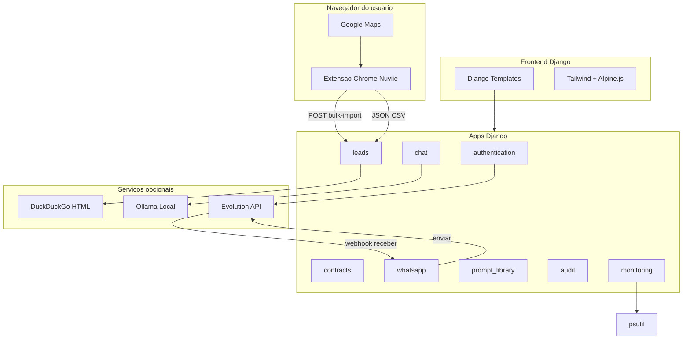
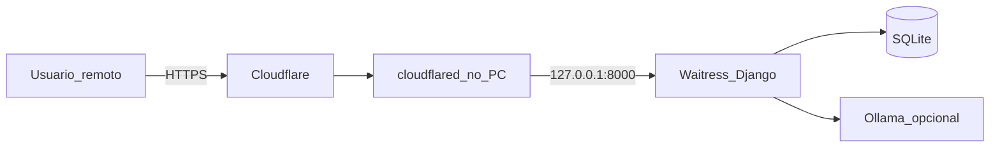

# 🚀 Nuviie Hub

> **Plataforma completa para prospecção local** — extraia leads do Google Maps no Chrome, gerencie vendas no Kanban, gere contratos em PDF e simule atendimento comercial com IA.


---

## ✨ O que é o Nuviie?

O **Nuviie Hub** é um monólito Django modular para uso **local** (você e sua equipe):

- 🗺️ **Extrair leads do Google Maps** via extensão Chrome (recomendado) — sem CAPTCHA, no navegador logado
- 📊 **Organizar oportunidades** num CRM Kanban visual
- 📄 **Gerar contratos** a partir de templates PDF
- 💬 **Simular atendimento** com IA local (Ollama)
- 🟢 **WhatsApp no CRM** — conecte 1+ números (Evolution API), envie e receba mensagens vinculadas aos leads
- 📚 **Biblioteca de Prompts** — CRUD global de prompts e categorias para a equipe
- ⚖️ **Regras de Pontuação** — motor configurável de score para leads (sem limite 0–100)
- 🔐 **Autenticar com segurança** — e-mail, WhatsApp OTP e login facial (perfil portátil entre PCs)

Interface moderna com tema escuro, Tailwind CSS e Alpine.js.

---

## 🧩 Módulos do Sistema

| Módulo | O que faz | Onde |
|--------|-----------|------|
| 📈 **Dashboard** | Métricas, gráficos e leads recentes | `/dashboard/` |
| 🗺️ **Extensão Maps** | Extração completa no Chrome (**recomendado**) | pasta `extension/` |
| 📥 **Importar Leads** | Upload JSON/CSV exportado pela extensão | `/leads/import/` |
| 📸 **Scraper Instagram** | Busca perfis por nicho e cidade | `/scraper/instagram/` |
| 📋 **CRM Kanban** | Pipeline de vendas com drag-and-drop e exclusão em massa | `/kanban/` |
| 💰 **Controle Financeiro** | Entradas, despesas, gráficos, export XLSX, lançamentos automáticos de contratos | `/financeiro/` |
| 🔔 **Notificações** | Alertas de prazo de projeto (4d/2d) in-app + navegador | sino no header |
| 📑 **Contratos** | Templates PDF + preview ao vivo + export PDF/DOCX | `/contracts/templates/` |
| 📊 **Analytics Servidor** | CPU, RAM, disco, rede (psutil) | `/monitoring/analytics/` |
| 📜 **Histórico** | Auditoria de ações no sistema | `/audit/history/` |
| 💬 **Chat IA** | Assistente comercial com Ollama | `/chat/` |
| 🟢 **WhatsApp** | Conectar números (QR), enviar/receber mensagens por lead (Evolution API) | `/whatsapp/` |
| 📚 **Biblioteca de Prompts** | CRUD global de prompts e categorias (título, conteúdo, cor) | `/biblioteca-prompts/` |
| ⚖️ **Regras de Pontuação** | CRUD global de regras e condições; score ilimitado | `/regras-pontuacao/` |
| 👤 **Autenticação** | Login, registro, face (portátil), OTP WhatsApp | `/auth/login/` |

---

## ⚡ Início Rápido

### 1️⃣ Pré-requisitos

- Python **3.12+**
- **Google Chrome** (para a extensão Maps)
- **Ollama** (opcional, só para o chat IA)

### 2️⃣ Instalar o Nuviie

```bash
cd Nuviie
python -m venv .venv
.venv\Scripts\activate        # Windows
# source .venv/bin/activate   # Linux/Mac
pip install -r requirements.txt
copy .env.example .env        # Windows
# cp .env.example .env        # Linux/Mac
```

### 3️⃣ Configurar o `.env`

Mínimo para rodar localmente:

```env
SECRET_KEY=sua-chave-secreta-aqui
DEBUG=true
ALLOWED_HOSTS=127.0.0.1,localhost

# Extensão Chrome (recomendado para Maps)
NUVIIE_EXTENSION_TOKEN=seu-token-secreto-aqui
NUVIIE_EXTENSION_USER=admin
```

> `NUVIIE_EXTENSION_USER` deve ser o **username** de um usuário Django existente (ex.: o criado com `createsuperuser`).

### 4️⃣ Banco e usuário

```bash
python manage.py migrate
python manage.py createsuperuser
```

### 5️⃣ Rodar o servidor

```bash
python manage.py runserver
```

Acesse: **http://127.0.0.1:8000/**

### 6️⃣ Instalar a extensão Chrome

1. Abra `chrome://extensions/`
2. Ative **Modo do desenvolvedor**
3. Clique em **Carregar sem compactação**
4. Selecione a pasta `Nuviie/extension/`

Pronto — o ícone **Nuviie Maps Extractor** aparece na barra do Chrome.

---

## 📖 Guia Completo por Funcionalidade

### 🗺️ Extensão Chrome — Nuviie Maps Extractor (recomendado)

**O que faz:** extrai leads completos do Google Maps **no seu Chrome logado**, sem Playwright e com muito menos bloqueio. Para cada lugar da lista, a extensão:

1. Clica na ficha no painel lateral
2. Faz scroll para carregar conteúdo lazy
3. Expande horários de funcionamento
4. Visita a aba **Sobre** (amenidades)
5. Visita a aba **Avaliações** (até 10 reviews recentes)
6. Revela telefone/endereço ocultos
7. Extrai todos os campos e segue para o próximo (com delay humano)

**Dados coletados por lead:**

| Campo | Exemplo |
|-------|---------|
| Nome, categoria, cidade | Escritório Silva, Advogado |
| Telefone / WhatsApp | (16) 99999-8888 |
| Site, Instagram, Facebook, YouTube, LinkedIn | @escritorio, URLs |
| Endereço, rating, nº de avaliações | Av. Paulista, 4.8, 127 |
| Horários (JSON) | seg–sex, aberto/fechado |
| Reviews recentes (JSON) | autor, nota, texto |
| Amenidades, Plus Code, faixa de preço | Wi-Fi, estacionamento |
| Link Google Maps | maps.google.com/... |

**Fluxo de uso:**

1. Abra [Google Maps](https://www.google.com/maps)
2. Busque (ex: `advogado Ribeirão Preto`)
3. **Role a lista** até carregar todos os resultados desejados
4. Clique no ícone **Nuviie Maps Extractor**
5. Preencha **Cidade** (obrigatório) e **Nicho** (opcional)
6. Clique em **Extrair completo**
7. Aguarde — ~2–4 s por lugar (50 lugares ≈ 2–3 min)
8. Escolha uma opção:
   - **Export JSON** ou **Export CSV** — salva arquivo local
   - **Enviar ao Nuviie** — envia direto pro CRM (configure token abaixo)

**Enviar direto ao Nuviie:**

1. No popup da extensão, abra **Nuviie local (opcional)**
2. URL: `http://127.0.0.1:8000`
3. Token: mesmo valor de `NUVIIE_EXTENSION_TOKEN` no `.env`
4. Com o servidor rodando, clique **Enviar ao Nuviie**

**Estrutura da extensão:**

```
extension/
├── manifest.json       → Manifest V3
├── popup.html/js/css   → Interface do popup
├── content.js          → Orquestrador no Maps
├── extract-all.js      → Extração principal (port do scraper)
├── extract-hours.js    → Horários de funcionamento
├── extract-reviews.js  → Avaliações recentes
├── extract-about.js    → Amenidades (aba Sobre)
├── navigate.js         → Cliques em abas, scroll, delays
├── mapper.js           → Converte dados → formato Lead
└── utils.js            → Helpers (dedup, telefone, etc.)
```

**Dicas:**

- Uma busca no Maps costuma mostrar até ~120 resultados — role bastante ou faça buscas por bairro/nicho
- Use **Parar** no popup se quiser interromper no meio
- **Limite 0** = extrai todos os lugares visíveis na lista
- Grátis para uso local — não precisa publicar na Chrome Web Store

---

### 📥 Importar Leads (arquivo)

**O que faz:** importa JSON ou CSV exportado pela extensão para o CRM.

**Como usar:**

1. Acesse `/leads/import/` (ou **Importar Leads** no dashboard)
2. Selecione o arquivo `.json` ou `.csv` exportado
3. Clique em **Importar leads**
4. Leads duplicados (mesmo telefone, nome ou Instagram) são ignorados automaticamente

---

### 📸 Scraper Instagram

**O que faz:** busca perfis do Instagram via DuckDuckGo usando nicho e localização.

**Como usar:** `/scraper/instagram/` — informe nicho, localização e filtros.

> Resultados dependem do DuckDuckGo — pode retornar zero em alguns nichos.

---

### 📋 CRM Kanban

**Status:** Novo Lead → Contatado → Em Negociação → Em Produção → Projeto Entregue / Perdido

**Como usar:**

1. Acesse `/kanban/`
2. Arraste cards entre colunas
3. Clique em um card para editar, ver notas ou abrir WhatsApp/Maps
4. Exporte em CSV/JSON, crie leads manualmente ou exclua em massa (selecionados / todos)

Cada lead tem **score de qualidade** calculado pelas regras em `/regras-pontuacao/` (ordenável no Kanban por mais quente/frio).

---

### 📑 Contratos PDF

Upload de templates com placeholders `{{ campo }}` ou `[CAMPO]`, preenchimento e download do PDF gerado.

Acesse: `/contracts/templates/`

---

### 💬 Atendente IA (multi-provedor)

O mesmo "cérebro" de IA atende o **Chat IA** (`/chat/`) e o **WhatsApp** (auto-resposta + rascunho assistido). Você escolhe o **motor** por um toggle:

- 🌐 **Nuvem** — provedores compatíveis com a API da OpenAI, tentados em **cadeia de fallback**: `OpenAI (GPT) → Gemini → Groq`. Se o primeiro falhar, tenta o próximo automaticamente.
- 💻 **Local** — modelo rodando na sua máquina via **Ollama** (custo zero, funciona offline).

O toggle é uma **escolha**, não um fallback: se você está em *Nuvem* e **todos** os provedores falham (ou em *Local* o Ollama cai), o cliente recebe uma **mensagem humana de "ocupado"** (ex.: *"opa, aqui tá meio corrido agora, me dá 1 minutinho 🙏"*) — nunca um erro técnico.

> Por padrão (`AI_DEFAULT_MODE=local`) tudo funciona out-of-the-box com o Ollama. Ligue a nuvem quando tiver as chaves.

#### Opção A — Local (Ollama)

```bash
ollama pull qwen2.5:7b
ollama serve
```

```env
AI_DEFAULT_MODE=local
OLLAMA_URL=http://localhost:11434/api/chat
OLLAMA_MODEL=qwen2.5:7b
```

#### Opção B — Nuvem (GPT / Gemini / Groq)

Basta ter **pelo menos uma** API key. Só entram na cadeia os provedores que tiverem chave configurada, na ordem de `AI_CLOUD_CHAIN`.

```env
AI_DEFAULT_MODE=cloud
AI_CLOUD_CHAIN=openai,gemini,groq

# OpenAI (GPT)
OPENAI_API_KEY=sk-...
OPENAI_MODEL=gpt-4o-mini

# Gemini (endpoint compatível com OpenAI)
GEMINI_API_KEY=AIza...
GEMINI_MODEL=gemini-1.5-flash

# Groq
GROQ_API_KEY=gsk_...
GROQ_MODEL=llama-3.3-70b-versatile
```

**Onde pegar cada chave (todas têm camada gratuita):**

| Provedor | Onde criar a chave | Observação |
|----------|--------------------|------------|
| **OpenAI (GPT)** | [platform.openai.com/api-keys](https://platform.openai.com/api-keys) | Modelos `gpt-4o-mini`, `gpt-4o`, etc. (uso pago/crédito) |
| **Gemini (Google)** | [aistudio.google.com/apikey](https://aistudio.google.com/apikey) | Camada gratuita generosa; usa o endpoint compatível com OpenAI |
| **Groq** | [console.groq.com/keys](https://console.groq.com/keys) | Gratuito e muito rápido; modelos Llama/Mixtral |

> Todos os 3 (e qualquer outro provedor "OpenAI-compatible") falam o mesmo formato `/chat/completions`, então **não é preciso instalar SDK nenhum** — tudo via `requests`.

Acesse `/chat/` e use o seletor **"Motor da IA"** no topo para alternar entre *Nuvem* e *Local* (a escolha fica salva por conversa). A IA **não é obrigatória** para leads e Kanban.

---

### 🟢 WhatsApp (Evolution API)

**O que faz:** conecta um ou mais números de WhatsApp ao CRM via **Evolution API** e permite **enviar e receber** mensagens vinculadas automaticamente aos leads (pelo telefone).

**Recursos:**

- ✅ **Vários números** — cada número é uma "instância"; defina um como padrão de envio
- 📲 **Conectar por QR Code** direto na tela (`/whatsapp/`)
- 💬 **Inbox** estilo chat: conversas, histórico e envio
- 🔗 **Vínculo automático** com o lead (casa o número, tolerante a DDI/9º dígito)
- 🔔 Mensagem recebida vira **notificação** no sino do header
- 🚀 Botão **WhatsApp CRM** no modal do lead abre a conversa já pronta
- 🤖 **Atendente IA por número** (opcional): resposta automática e rascunho assistido

**Pré-requisitos:**

1. Um servidor **Evolution API** rodando (Docker é o jeito mais comum)
2. No `.env`: `EVOLUTION_API_URL` e `EVOLUTION_API_KEY`
3. Para **receber** mensagens: `WHATSAPP_WEBHOOK_TOKEN` (token forte) e `NUVIIE_PUBLIC_BASE_URL` (URL pública, ex.: Cloudflare Tunnel)

> Só **enviar** mensagens já funciona apenas com `EVOLUTION_API_URL` + `EVOLUTION_API_KEY`.
> O **recebimento** exige o webhook (token + URL pública), pois o Evolution precisa alcançar o CRM.

**Como usar:**

1. Configure o `.env` (veja acima) e reinicie o servidor
2. Acesse **WhatsApp** no menu lateral → **Adicionar número**
3. Informe um nome (ex.: *Comercial*) e um identificador de instância (ex.: *nuviie-comercial*)
4. Clique em **Conectar** e leia o **QR Code** no app do WhatsApp (Aparelhos conectados)
5. Repita para um **segundo número**, se quiser, e marque um como **padrão**
6. Converse pela tela `/whatsapp/` ou pelo botão **WhatsApp CRM** dentro do lead

> O OTP de recuperação de senha usa a instância única `EVOLUTION_INSTANCE`. Já o
> módulo do CRM gerencia os números pela tela (não usa `EVOLUTION_INSTANCE`).

**🤖 Atendente IA no WhatsApp (opcional):**

Em cada número (card na tela `/whatsapp/`) você tem dois controles de IA:

- **Resposta automática (IA)** — *desligada por padrão*. Quando ligada, toda mensagem recebida naquele número é respondida sozinha pela IA, usando o mesmo "vendedor" do Chat IA e o histórico da conversa como memória. Responde em background, com um pequeno atraso humano.
- **Motor da IA** (Padrão / Nuvem / Local) — escolhe se aquele número usa a nuvem ou o Ollama local (igual ao toggle do Chat IA).

Sem ligar a auto-resposta, você ainda pode usar o **rascunho assistido**: no inbox, clique no botão ✨ ao lado do campo de texto para a IA **sugerir** uma resposta — ela preenche o campo para você revisar/editar e enviar. Nada é enviado sem você confirmar.

> A auto-resposta usa o webhook (precisa de `WHATSAPP_WEBHOOK_TOKEN` + URL pública). Se a IA estiver indisponível, o número simplesmente **não responde** naquele momento (não manda erro técnico ao cliente).

---

### 📚 Biblioteca de Prompts

**O que faz:** repositório **global** de prompts da equipe — todos os usuários autenticados veem, criam, editam e excluem os mesmos registros.

**Campos:**

| Entidade | Campos |
|----------|--------|
| **Categoria** | Nome, cor (badge visual) |
| **Prompt** | Título, conteúdo (texto longo), categoria |

**Como usar:**

1. Acesse `/biblioteca-prompts/` (ou **Biblioteca de Prompts** no menu lateral)
2. Crie **categorias** (ex.: Vendas, Instagram, Contratos, Atendimento)
3. Adicione **prompts** vinculados a uma categoria
4. Use **Copiar** no card para colar o texto onde precisar
5. Filtre por categoria ou busque por título/conteúdo

**Regras:**

- Não é possível excluir uma categoria que ainda tenha prompts vinculados
- A biblioteca é compartilhada entre todos os logins (sem prompts por usuário)

**API REST** (requer login):

| Método | Endpoint |
|--------|----------|
| GET/POST | `/api/prompt-categories/` |
| GET/PATCH/DELETE | `/api/prompt-categories/{id}/` |
| GET/POST | `/api/prompts/` |
| GET/PATCH/DELETE | `/api/prompts/{id}/` |

Filtros em prompts: `?category=<id>` e `?search=<texto>`

---

### ⚖️ Regras de Pontuação

**O que faz:** motor **global** e configurável que calcula a pontuação de cada lead com base em regras que você define. Não há limite de 0 a 100 — pontos positivos e negativos se acumulam livremente.

**Como usar:**

1. Acesse `/regras-pontuacao/` para criar/editar regras
2. Cada regra tem **pontos** (+/-) e **condições** (campo + operador + valor)
3. Combine condições com **AND** (todas) ou **OR** (qualquer)
4. No Kanban, ordene por **Mais quente** / **Mais frio** e veja o score nos cards
5. No modal do lead, veja o **breakdown**: regras aplicadas e não aplicadas, com motivo

**Exemplos de regras:**

- Seguidores entre 2k–5k **sem site** → +50 pts (duas condições AND)
- Já tem site próprio → -15 pts

**API REST** (requer login):

| Método | Endpoint |
|--------|----------|
| GET | `/api/scoring-fields/` — campos disponíveis para condições |
| GET/POST | `/api/scoring-rules/` |
| GET/PATCH/DELETE | `/api/scoring-rules/{id}/` |
| POST | `/api/scoring-rules/recalculate/` — recalcula todos os leads |

---

### 🔐 Autenticação

- Login/cadastro: `/auth/login/` e `/auth/register/`
- Login facial: `/auth/face-register/` + `/auth/face-login/`
- Reset de senha via WhatsApp: `/auth/password-reset/` (Evolution API ou simulado no console)

**🔁 Login facial portátil (entre PCs / após `git clone`):**

O embedding facial (vetor, **não** a foto) fica no banco, mas é espelhado em
arquivos versionáveis em `authentication/face_profiles/<email>.json`. Assim o
cadastro sobrevive a troca de computador e a um `git clone`.

- **Automático:** ao cadastrar/ativar o rosto, o arquivo é gerado; no boot do
  servidor e na tela de login facial os arquivos são restaurados para o banco
  (casando pelo **e-mail** do usuário).
- **Manual:**

```bash
python manage.py sync_faces             # restaura arquivos -> banco (não sobrescreve)
python manage.py sync_faces --overwrite # restaura e sobrescreve
python manage.py sync_faces --export    # exporta banco -> arquivos
```

> **Levar um cadastro antigo para outro PC:** no PC onde o rosto já está
> cadastrado, rode `python manage.py sync_faces --export`, faça commit da pasta
> `authentication/face_profiles/` e dê `git pull` no outro PC (login com o mesmo e-mail).
> Esses `.json` contêm dados biométricos e são versionados de propósito — se
> preferir não commitar, adicione `authentication/face_profiles/*.json` ao `.gitignore`.

---

## 🔌 API REST

Base: `http://127.0.0.1:8000/api/leads/`

### Importação em lote (extensão Chrome)

```bash
curl -X POST http://127.0.0.1:8000/api/leads/bulk-import/ \
  -H "Content-Type: application/json" \
  -H "X-Nuviie-Token: seu-token-secreto-aqui" \
  -d '{
    "city": "Ribeirão Preto",
    "leads": [
      {
        "name": "Escritório Exemplo",
        "category": "Advogado",
        "phone_number": "(16) 99999-8888",
        "source": "google_maps"
      }
    ]
  }'
```

Resposta: `{"saved": 1, "skipped": 0, "errors": []}`

### Listar / filtrar leads (requer login)

```bash
curl -u email@exemplo.com:senha http://127.0.0.1:8000/api/leads/
curl -u email@exemplo.com:senha "http://127.0.0.1:8000/api/leads/?status=novo"
curl -u email@exemplo.com:senha "http://127.0.0.1:8000/api/leads/?search=advogado"
```

### Atualizar status (Kanban)

```bash
curl -X PATCH -u email@exemplo.com:senha \
  -H "Content-Type: application/json" \
  -d '{"status": "contatado"}' \
  http://127.0.0.1:8000/api/leads/1/update-status/
```

### Exportar leads

- CSV: `/leads/export/?format=csv`
- JSON: `/leads/export/?format=json`

### Biblioteca de Prompts (requer login)

```bash
# Listar categorias
curl -u email@exemplo.com:senha http://127.0.0.1:8000/api/prompt-categories/

# Criar categoria
curl -X POST -u email@exemplo.com:senha \
  -H "Content-Type: application/json" \
  -d '{"name": "Vendas", "color": "#6366f1"}' \
  http://127.0.0.1:8000/api/prompt-categories/

# Listar prompts (filtros opcionais)
curl -u email@exemplo.com:senha "http://127.0.0.1:8000/api/prompts/?category=1&search=whatsapp"

# Criar prompt
curl -X POST -u email@exemplo.com:senha \
  -H "Content-Type: application/json" \
  -d '{"title": "Abordagem fria", "content": "Olá...", "category": 1}' \
  http://127.0.0.1:8000/api/prompts/
```

### WhatsApp (requer login)

| Método | Endpoint | Descrição |
|--------|----------|-----------|
| GET/POST | `/api/whatsapp/instances/` | Lista/cria números (instâncias) |
| POST | `/api/whatsapp/instances/{id}/connect/` | Cria a instância no Evolution e retorna o QR |
| GET | `/api/whatsapp/instances/{id}/state/` | Estado da conexão (sincroniza status) |
| POST | `/api/whatsapp/instances/{id}/set-default/` | Define como número padrão de envio |
| POST | `/api/whatsapp/instances/{id}/logout/` | Desconecta o número |
| GET | `/api/whatsapp/messages/conversations/` | Conversas agrupadas por telefone |
| GET | `/api/whatsapp/messages/?lead={id}` | Mensagens de um lead (ou `?phone=`) |
| POST | `/api/whatsapp/messages/send/` | Envia texto (`{lead, phone, text}`) |
| POST | `/api/whatsapp/messages/suggest/` | Gera um rascunho de resposta com IA (`{phone, lead}`), sem enviar |
| PATCH | `/api/whatsapp/instances/{id}/` | Atualiza o número (ex.: `ai_autoreply_enabled`, `ai_mode`) |
| POST | `/api/whatsapp/webhook/` | Recebe eventos do Evolution (Bearer token) |

### Health check

```bash
curl http://127.0.0.1:8000/health/
# {"status": "ok"}
```

---

## ⚙️ Variáveis de Ambiente

Copie `.env.example` para `.env`:

| Variável | Obrigatório | Descrição | Padrão |
|----------|-------------|-----------|--------|
| `SECRET_KEY` | Produção | Chave secreta Django | dev fallback |
| `DEBUG` | Não | `true` / `false` | `true` |
| `ALLOWED_HOSTS` | Produção | Hosts separados por vírgula | `127.0.0.1,localhost` |
| `CSRF_TRUSTED_ORIGINS` | Produção (HTTPS) | Origens CSRF, ex: `https://crm.seudominio.com` | vazio |
| `NUVIIE_PUBLIC_BASE_URL` | Produção / extensão | URL pública do CRM | `http://127.0.0.1:8000` |
| `NUVIIE_EXTENSION_TOKEN` | Extensão | Token para `X-Nuviie-Token` | vazio |
| `NUVIIE_EXTENSION_USER` | Extensão | Username Django que recebe os leads | `admin` |
| `CORS_ALLOWED_ORIGINS` | Não | Origens CORS permitidas | vazio (DEBUG = aberto) |
| `OLLAMA_URL` | Não | URL da API Ollama (modo local) | `localhost:11434` |
| `OLLAMA_MODEL` | Não | Modelo Ollama (modo local) | `qwen2.5:7b` |
| `AI_DEFAULT_MODE` | Não | Motor padrão da IA: `local` ou `cloud` | `local` |
| `AI_CLOUD_CHAIN` | Não | Ordem de fallback dos provedores de nuvem (CSV) | `openai,gemini,groq` |
| `AI_CLOUD_FALLBACK_LOCAL` | Não | Se a nuvem falhar inteira, tentar o Ollama local? | `false` |
| `AI_HTTP_TIMEOUT` | Não | Timeout (s) das chamadas de nuvem | `60` |
| `AI_HTTP_TIMEOUT_LOCAL` | Não | Timeout (s) do Ollama local | `180` |
| `OPENAI_API_KEY` / `OPENAI_MODEL` / `OPENAI_BASE_URL` | IA nuvem | Credenciais GPT (sem chave = desativado) | — / `gpt-4o-mini` / API oficial |
| `GEMINI_API_KEY` / `GEMINI_MODEL` / `GEMINI_BASE_URL` | IA nuvem | Credenciais Gemini (endpoint compatível com OpenAI) | — / `gemini-1.5-flash` / API oficial |
| `GROQ_API_KEY` / `GROQ_MODEL` / `GROQ_BASE_URL` | IA nuvem | Credenciais Groq | — / `llama-3.3-70b-versatile` / API oficial |
| `EVOLUTION_API_URL` | WhatsApp | Endereço do servidor Evolution API (envio e recebimento) | simulado no console |
| `EVOLUTION_API_KEY` | WhatsApp | API key global do Evolution | — |
| `EVOLUTION_INSTANCE` | OTP | Instância única usada **só** pelo OTP de senha | — |
| `WHATSAPP_WEBHOOK_TOKEN` | Receber msgs | Token Bearer do webhook Evolution → Nuviie (sem ele, só envio funciona) | vazio |

---

## 🏗️ Arquitetura



```
Nuviie/
├── core/              → settings, urls, wsgi
├── authentication/    → login, OTP, face recognition (perfil portátil em face_profiles/)
├── leads/             → import_utils, instagram_scraper, Lead model, Kanban, API
├── extension/         → Extensão Chrome Maps Extractor (MV3)
├── contracts/         → PDF/DOCX templates, parser inteligente, geração
├── audit/             → ActivityLog e histórico de auditoria
├── monitoring/        → Analytics do servidor (psutil)
├── chat/              → conversas com Ollama
├── whatsapp/          → WhatsApp via Evolution API (instâncias, envio, webhook, inbox)
├── prompt_library/    → biblioteca global de prompts e categorias (CRUD + API)
├── lead_scoring/      → motor e CRUD de regras de pontuação de leads
├── templates/         → HTML (auth, leads, contracts, chat, whatsapp, prompt_library, lead_scoring)
├── deploy/            → scripts Windows (Waitress, backup, Cloudflare Tunnel)
├── .env.example       → template de configuração
└── manage.py
```

---

## Deploy em PC local + Cloudflare Tunnel

Use esta opção para rodar o Nuviie **grátis** num PC Windows fixo em casa e permitir acesso remoto (você + parceiro em outra cidade) via **HTTPS**, sem abrir porta no roteador.



### Requisitos

- PC Windows **ligado 24/7** (desative suspensão/hibernação)
- Python 3.12+ e projeto instalado (veja [Início Rápido](#-início-rápido))
- Conta gratuita [Cloudflare](https://cloudflare.com) + domínio (ou subdomínio no Cloudflare)
- [cloudflared](https://developers.cloudflare.com/cloudflare-one/connections/connect-networks/downloads/) instalado no PC
- Ollama opcional (chat IA local)

### 1. Configurar `.env` para produção

Copie `.env.example` → `.env` e ajuste:

```env
DEBUG=false
SECRET_KEY=sua-chave-gerada-aqui
ALLOWED_HOSTS=127.0.0.1,localhost,crm.seudominio.com
CSRF_TRUSTED_ORIGINS=https://crm.seudominio.com
NUVIIE_PUBLIC_BASE_URL=https://crm.seudominio.com
NUVIIE_EXTENSION_TOKEN=token-forte-aleatorio
NUVIIE_EXTENSION_USER=admin
CORS_ALLOWED_ORIGINS=https://crm.seudominio.com
OLLAMA_URL=http://127.0.0.1:11434/api/chat

# WhatsApp (Evolution API) — opcional
EVOLUTION_API_URL=https://sua-evolution-api.com
EVOLUTION_API_KEY=sua-api-key
WHATSAPP_WEBHOOK_TOKEN=token-forte-do-webhook
```

> Com a URL pública (`NUVIIE_PUBLIC_BASE_URL`) + `WHATSAPP_WEBHOOK_TOKEN`, o
> Evolution consegue entregar as mensagens recebidas no CRM (webhook).

Gere `SECRET_KEY`:

```powershell
python -c "from django.core.management.utils import get_random_secret_key; print(get_random_secret_key())"
```

### 2. Preparar o banco (primeira vez)

```powershell
cd Nuviie
.venv\Scripts\activate
python manage.py migrate
python manage.py createsuperuser
```

Crie um **segundo usuário** no admin Django para seu parceiro remoto.

### 3. Subir o servidor (Waitress)

O Django escuta **apenas em localhost** — o tunnel expõe HTTPS publicamente.

```powershell
.\deploy\windows\run-production.ps1
```

Teste local: `http://127.0.0.1:8000/health/` → `{"status": "ok"}`

### 4. Cloudflare Tunnel

1. Instale **cloudflared** no Windows.
2. Login e crie o tunnel:

```powershell
cloudflared tunnel login
cloudflared tunnel create nuviie
```

3. Copie [`deploy/windows/cloudflared-config.example.yml`](deploy/windows/cloudflared-config.example.yml) para `%USERPROFILE%\.cloudflared\config.yml`.
4. Substitua `TUNNEL_ID` e `crm.seudominio.com` pelos seus valores.
5. Aponte DNS:

```powershell
cloudflared tunnel route dns nuviie crm.seudominio.com
```

6. Instale e inicie como serviço Windows:

```powershell
cloudflared service install
cloudflared service start
```

Agora `https://crm.seudominio.com` aponta para o Nuviie no seu PC.

### 5. Iniciar com o Windows (opcional)

Execute **como Administrador**:

```powershell
.\deploy\windows\install-task-scheduler.ps1
```

Registra:
- **Nuviie-Production** — Waitress ao ligar o PC
- **Nuviie-Backup** — backup diário às 03:00

O **cloudflared** continua sendo serviço separado (passo 4).

### 6. Extensão Chrome (Maps / Instagram)

No popup da extensão → **Nuviie local (opcional)**:

- **URL:** `https://crm.seudominio.com`
- **Token:** mesmo valor de `NUVIIE_EXTENSION_TOKEN` no `.env`

### 7. Backup

Manual:

```powershell
.\deploy\windows\backup.ps1
```

Salva `db.sqlite3` e `media/` em `deploy/backups/`. Copie essa pasta para nuvem (Google Drive, etc.).

### Checklist antes de usar remotamente

- [ ] `DEBUG=false` no `.env`
- [ ] `SECRET_KEY` única (não a de dev)
- [ ] `CSRF_TRUSTED_ORIGINS` com `https://` do seu domínio
- [ ] Waitress rodando (`run-production.ps1`)
- [ ] Cloudflare Tunnel ativo
- [ ] Login remoto funciona sem erro CSRF
- [ ] Extensão envia lead com URL + token corretos

### Limitações

- **PC ou internet off** → ninguém acessa o CRM.
- **SQLite** é suficiente para 2 usuários; para equipe maior, migre para PostgreSQL depois.
- **Login facial (InsightFace)** consome RAM — teste no PC servidor; desabilite se ficar pesado.

### Rede local (sem Cloudflare)

Para teste na mesma Wi‑Fi apenas:

```powershell
python manage.py runserver 0.0.0.0:8000
```

Adicione o IP da máquina em `ALLOWED_HOSTS`. Não use isso como produção exposta na internet.

---

## 🧪 Testes

```bash
python manage.py test
```

Testes rodam offline — scrapers são mockados, sem depender de Playwright ou rede.

---

## ❓ FAQ

**Qual a melhor forma de extrair leads do Maps?**
Use a **extensão Chrome** (`extension/`). É mais estável, roda no navegador logado e não precisa de Playwright.

**Preciso do Playwright?**
Não, se usar a extensão. Playwright só é necessário para o scraper legado em `/scraper/maps/`.

**Preciso do Ollama?**
Não. Só o módulo de Chat IA depende dele.

**Como compartilhar leads entre duas pessoas?**
Cada um instala a extensão. Exporte JSON/CSV e compartilhe o arquivo, ou apontem a extensão para o mesmo Nuviie local na rede.

**Por que o scraper Playwright retornou zero leads?**
Use a extensão Chrome. O scraper legado sofre com CAPTCHA, cookies e instabilidade do headless.

**A extensão é grátis?**
Sim, para uso local. Carregue sem compactação no Chrome — não precisa publicar na loja (~US$ 5 só se quiser distribuir publicamente).

---

## 🗺️ Roadmap

- [x] Extensão Chrome Maps Extractor (MV3)
- [x] Importação bulk via API token + upload CSV/JSON
- [x] Biblioteca de Prompts (CRUD global + API REST)
- [x] Regras de Pontuação configuráveis (CRUD + breakdown no Kanban)
- [x] WhatsApp no CRM via Evolution API (multi-número, envio/recebimento, inbox)
- [x] Login facial portátil (perfil em arquivo, sobrevive a troca de PC/clone)
- [ ] Integrar prompts com o Chat IA (“Usar no Chat”)
- [ ] Fila de tarefas (Celery) para scrapers longos
- [ ] Suporte PostgreSQL via `DATABASE_URL`
- [ ] Vincular contratos gerados a leads do CRM
- [ ] Tailwind compilado localmente (sem CDN)

---

## 📄 Licença

MIT License — use, modifique e distribua livremente.

---

<p align="center">
  Feito com 💙 pela equipe <strong>Nuviie</strong>
</p>
